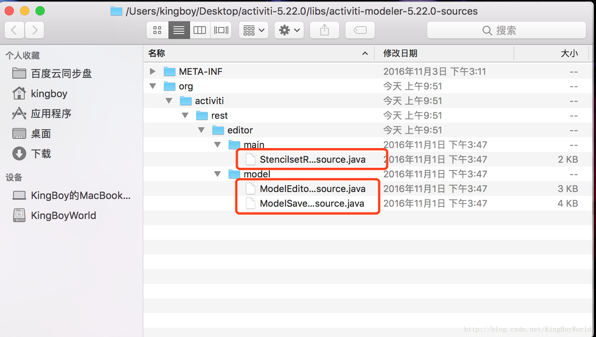
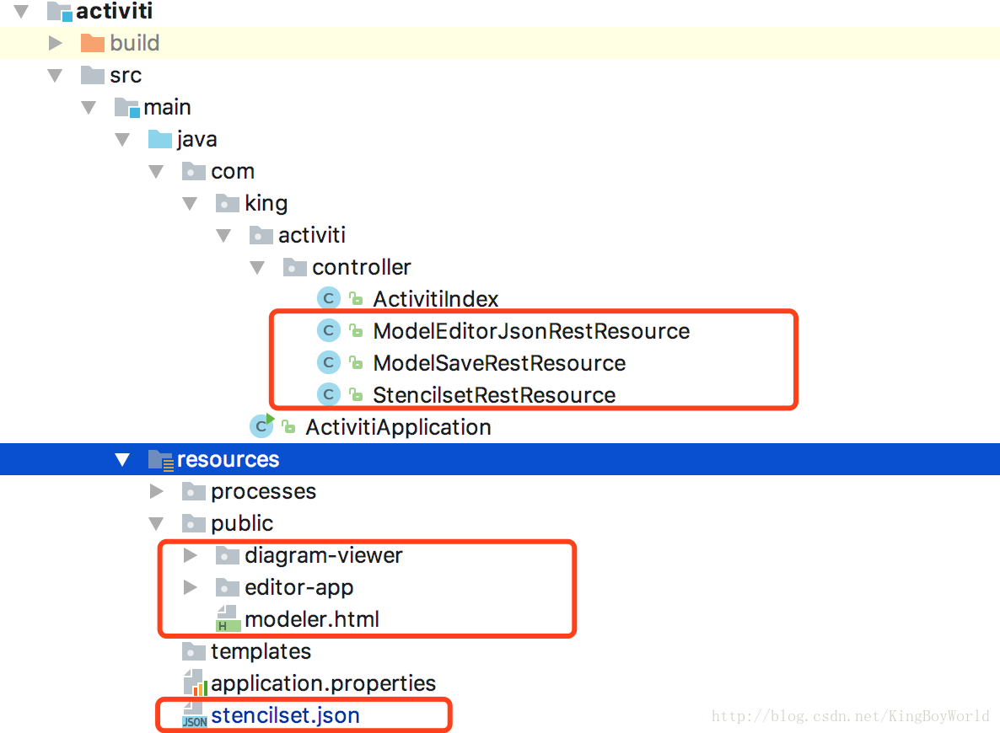

# activiti-demo
集成了的技术组件：
* activiti 5.22
* springboot 1.5.9
* druid
* mybatis
* fastjson
* swagger

### 集成activiti modeler5.22
#### 一、集成准备

下载activiti源码及activiti-5.22.zip
https://github.com/Activiti/Activiti/releases?after=activiti-6.0.0.RC1

1.源码下载
https://github.com/Activiti/Activiti/archive/activiti-5.22.0.zip

2.Activiti-5.22.0.zip下载
https://github.com/Activiti/Activiti/releases/download/activiti-5.22.0/activiti-5.22.0.zip


#### 二、复制项目文件到自己的项目中

1.进入源码文件中的modules\activiti-webapp-explorer2\src\main\webapp目录，复制diagram-viewer、editor-app、modeler.html三个文件到springboot项目中的resources目录下。(主要是前端页面)
2.将源码路径modules\activiti-webapp-explorer2\src\main\resources\stencilset.json复制到springboot项目中的resources目录下。(这个文件是控制界面的语言的，附一个中文的文件下载地址stencilest.json-中文

3.解压activiti-5.22.0.zip，在Activiti-5.22.0的libs中找到activiti-modeler-5.22.0-sources.jar，将其解压，将会找到以下三个类：(三个controller) 

4.将以下三个类复制到自己的springboot项目的包中,只要包是位于启动类的下层包即可，这样springboot就会自动扫描到这三个类。

5.至此，所有需要的文件都复制完成，接下来，我们开始配置修改。项目结构如下: 


#### 三、修改配置

1.添加依赖，并刷新项目(这是Gradle的，Maven自己转换一下)
```
    dependencies {
        compile('org.activiti:activiti-spring-boot-starter-basic:5.22.0')
        compile("org.springframework.boot:spring-boot-starter-web")
        testCompile('org.springframework.boot:spring-boot-starter-test')
        compile('org.activiti:activiti-modeler:5.22.0')
        compile('commons-io:commons-io:2.5')
    }
```
2.修改springboot的启动类, 在类上加如下注解，关闭security功能。
主要是因为activiti的依赖中含有spring security的jar包，所以springboot会自动配置安全功能，访问时就需要输入密码。
```
@EnableAutoConfiguration(exclude = {
        org.springframework.boot.autoconfigure.security.SecurityAutoConfiguration.class,
        org.activiti.spring.boot.SecurityAutoConfiguration.class,
})
```
3.修改 resources目录下的app-cfg.js, 如下更改(这个是项目的路径，springboot是不需要项目路径的，所以把项目路径删除掉)
```
ACTIVITI.CONFIG = {
    'contextRoot' : '/service',
};
```
4.还记得我们前面复制进来的三个类吗？
在每个类的类名上加上RequestMapping(value = “/service”)注解。(页面会访问这个路径)

5.修改ModelSaveRestResource类 
(不修改这个的话，在页面保存流程时会报错)
```
@RestController
@RequestMapping(value = "/service")
public class ModelSaveRestResource implements ModelDataJsonConstants {

  protected static final Logger LOGGER = LoggerFactory.getLogger(ModelSaveRestResource.class);

  @Autowired
  private RepositoryService repositoryService;

  @Autowired
  private ObjectMapper objectMapper;

  @RequestMapping(value="/model/{modelId}/save", method = RequestMethod.PUT)
  @ResponseStatus(value = HttpStatus.OK)
  public void saveModel(@PathVariable String modelId, @RequestParam("name") String name,
                        @RequestParam("json_xml") String json_xml, 
                        @RequestParam("svg_xml") String svg_xml,
                        @RequestParam("description") String description) {//对接收参数进行了修改
    try {

      Model model = repositoryService.getModel(modelId);

      ObjectNode modelJson = (ObjectNode) objectMapper.readTree(model.getMetaInfo());

      modelJson.put(MODEL_NAME, name);
      modelJson.put(MODEL_DESCRIPTION, description);
      model.setMetaInfo(modelJson.toString());
      model.setName(name);

      repositoryService.saveModel(model);

      repositoryService.addModelEditorSource(model.getId(), json_xml.getBytes("utf-8"));

      InputStream svgStream = new ByteArrayInputStream(svg_xml.getBytes("utf-8"));
      TranscoderInput input = new TranscoderInput(svgStream);

      PNGTranscoder transcoder = new PNGTranscoder();
      // Setup output
      ByteArrayOutputStream outStream = new ByteArrayOutputStream();
      TranscoderOutput output = new TranscoderOutput(outStream);

      // Do the transformation
      transcoder.transcode(input, output);
      final byte[] result = outStream.toByteArray();
      repositoryService.addModelEditorSourceExtra(model.getId(), result);
      outStream.close();

    } catch (Exception e) {
      LOGGER.error("Error saving model", e);
      throw new ActivitiException("Error saving model", e);
    }
  }
}
```
#### 四、编写测试

新建一个controller如下
```
import com.fasterxml.jackson.databind.JsonNode;
import com.fasterxml.jackson.databind.ObjectMapper;
import com.fasterxml.jackson.databind.node.ObjectNode;
import io.swagger.annotations.Api;
import io.swagger.annotations.ApiOperation;
import org.activiti.bpmn.converter.BpmnXMLConverter;
import org.activiti.bpmn.model.BpmnModel;
import org.activiti.editor.constants.ModelDataJsonConstants;
import org.activiti.editor.language.json.converter.BpmnJsonConverter;
import org.activiti.engine.ProcessEngine;
import org.activiti.engine.RepositoryService;
import org.activiti.engine.repository.Deployment;
import org.activiti.engine.repository.DeploymentBuilder;
import org.activiti.engine.repository.Model;
import org.activiti.explorer.util.XmlUtil;
import org.apache.commons.lang3.StringUtils;
import org.springframework.beans.factory.annotation.Autowired;
import org.springframework.web.bind.annotation.*;
import org.springframework.web.multipart.MultipartFile;

import javax.xml.stream.XMLInputFactory;
import javax.xml.stream.XMLStreamReader;
import java.io.ByteArrayInputStream;
import java.io.IOException;
import java.io.InputStreamReader;
import java.io.UnsupportedEncodingException;
import java.util.HashMap;
import java.util.List;
import java.util.Map;

/**
 * 流程模型Model操作相关
 * Created by chenhai on 2017/5/23.
 */
@Api(description = "流程模型Model操作相关", tags = {"modeler"})
@RestController
@RequestMapping("models")
public class ModelController {

    @Autowired
    private ProcessEngine processEngine;
    @Autowired
    private ObjectMapper objectMapper;
    @Autowired
    private RepositoryService repositoryService;

    /**
     * 新建一个空模型
     *
     * @return
     * @throws UnsupportedEncodingException
     */
    @ApiOperation(value = "新建一个空模型")
    @PostMapping
    public Map<String,Object> newModel() throws UnsupportedEncodingException {
        RepositoryService repositoryService = processEngine.getRepositoryService();
        //初始化一个空模型
        Model model = repositoryService.newModel();

        //设置一些默认信息，可以用参数接收
        String name = "new-process";
        String description = "";
        int revision = 1;
        String key = "process";

        ObjectNode modelNode = objectMapper.createObjectNode();
        modelNode.put(ModelDataJsonConstants.MODEL_NAME, name);
        modelNode.put(ModelDataJsonConstants.MODEL_DESCRIPTION, description);
        modelNode.put(ModelDataJsonConstants.MODEL_REVISION, revision);

        model.setName(name);
        model.setKey(key);
        model.setMetaInfo(modelNode.toString());

        repositoryService.saveModel(model);
        String id = model.getId();

        //完善ModelEditorSource
        ObjectNode editorNode = objectMapper.createObjectNode();
        editorNode.put("id", "canvas");
        editorNode.put("resourceId", "canvas");
        ObjectNode stencilSetNode = objectMapper.createObjectNode();
        stencilSetNode.put("namespace",
                "http://b3mn.org/stencilset/bpmn2.0#");
        editorNode.put("stencilset", stencilSetNode);
        repositoryService.addModelEditorSource(id, editorNode.toString().getBytes("utf-8"));
//        return new ModelAndView("redirect:/modeler.html?modelId=" + id);
        return success();
    }

    /**
     * 获取所有模型
     *
     * @return
     */
    @ApiOperation(value = "获取所有模型")
    @GetMapping
    public List<Model> modelList() {
        RepositoryService repositoryService = processEngine.getRepositoryService();
        return repositoryService.createModelQuery().orderByCreateTime().desc().list();
    }

    /**
     * 删除模型
     *
     * @param id
     * @return
     */
    @ApiOperation(value = "删除模型")
    @DeleteMapping("{id}")
    public Object deleteModel(@PathVariable("id") String id) {
        RepositoryService repositoryService = processEngine.getRepositoryService();
        repositoryService.deleteModel(id);
        return success();
    }

    /**
     * 发布模型为流程定义
     *
     * @param id
     * @return
     * @throws Exception
     */
    @ApiOperation(value = "发布模型为流程定义")
    @PostMapping("{id}/deployment")
    public Object deploy(@PathVariable("id") String id) throws Exception {

        //获取模型
        RepositoryService repositoryService = processEngine.getRepositoryService();
        Model modelData = repositoryService.getModel(id);
        byte[] bytes = repositoryService.getModelEditorSource(modelData.getId());

        if (bytes == null) {
            return failed("模型数据为空，请先设计流程并成功保存，再进行发布。");
        }

        JsonNode modelNode = new ObjectMapper().readTree(bytes);

        BpmnModel model = new BpmnJsonConverter().convertToBpmnModel(modelNode);
        if (model.getProcesses().size() == 0) {
            return failed("数据模型不符要求，请至少设计一条主线流程。");
        }
        byte[] bpmnBytes = new BpmnXMLConverter().convertToXML(model);

        //发布流程
        String processName = modelData.getName() + ".bpmn20.xml";
        DeploymentBuilder deploymentBuilder = repositoryService.createDeployment()
                .name(modelData.getName())
                .addString(processName, new String(bpmnBytes, "UTF-8"));

        Deployment deployment = deploymentBuilder.deploy();
        modelData.setDeploymentId(deployment.getId());
        repositoryService.saveModel(modelData);

        return success();
    }

    @ApiOperation(value = "上传一个已有模型")
    @RequestMapping(value = "/uploadFile", method = RequestMethod.POST)
    public void deployUploadedFile(
            @RequestParam("uploadfile") MultipartFile uploadfile) {
        InputStreamReader in = null;
        try {
            try {
                boolean validFile = false;
                String fileName = uploadfile.getOriginalFilename();
                if (fileName.endsWith(".bpmn20.xml") || fileName.endsWith(".bpmn")) {
                    validFile = true;

                    XMLInputFactory xif = XmlUtil.createSafeXmlInputFactory();
                    in = new InputStreamReader(new ByteArrayInputStream(uploadfile.getBytes()), "UTF-8");
                    XMLStreamReader xtr = xif.createXMLStreamReader(in);
                    BpmnModel bpmnModel = new BpmnXMLConverter().convertToBpmnModel(xtr);

                    if (bpmnModel.getMainProcess() == null || bpmnModel.getMainProcess().getId() == null) {
//                        notificationManager.showErrorNotification(Messages.MODEL_IMPORT_FAILED,
//                                i18nManager.getMessage(Messages.MODEL_IMPORT_INVALID_BPMN_EXPLANATION));
                        System.out.println("err1");
                    } else {

                        if (bpmnModel.getLocationMap().isEmpty()) {
//                            notificationManager.showErrorNotification(Messages.MODEL_IMPORT_INVALID_BPMNDI,
//                                    i18nManager.getMessage(Messages.MODEL_IMPORT_INVALID_BPMNDI_EXPLANATION));
                            System.out.println("err2");
                        } else {

                            String processName = null;
                            if (StringUtils.isNotEmpty(bpmnModel.getMainProcess().getName())) {
                                processName = bpmnModel.getMainProcess().getName();
                            } else {
                                processName = bpmnModel.getMainProcess().getId();
                            }
                            Model modelData;
                            modelData = repositoryService.newModel();
                            ObjectNode modelObjectNode = new ObjectMapper().createObjectNode();
                            modelObjectNode.put(ModelDataJsonConstants.MODEL_NAME, processName);
                            modelObjectNode.put(ModelDataJsonConstants.MODEL_REVISION, 1);
                            modelData.setMetaInfo(modelObjectNode.toString());
                            modelData.setName(processName);

                            repositoryService.saveModel(modelData);

                            BpmnJsonConverter jsonConverter = new BpmnJsonConverter();
                            ObjectNode editorNode = jsonConverter.convertToJson(bpmnModel);

                            repositoryService.addModelEditorSource(modelData.getId(), editorNode.toString().getBytes("utf-8"));
                        }
                    }
                } else {
//                    notificationManager.showErrorNotification(Messages.MODEL_IMPORT_INVALID_FILE,
//                            i18nManager.getMessage(Messages.MODEL_IMPORT_INVALID_FILE_EXPLANATION));
                    System.out.println("err3");
                }
            } catch (Exception e) {
                String errorMsg = e.getMessage().replace(System.getProperty("line.separator"), "<br/>");
//                notificationManager.showErrorNotification(Messages.MODEL_IMPORT_FAILED, errorMsg);
                System.out.println("err4");
            }
        } finally {
            if (in != null) {
                try {
                    in.close();
                } catch (IOException e) {
//                    notificationManager.showErrorNotification("Server-side error", e.getMessage());
                    System.out.println("err5");
                }
            }
        }
    }


    private Map<String,Object> success() {
        Map<String,Object> map = new HashMap();
        map.put("status",true);
        map.put("reason","操作成功");
        return map;
    }

    private Map<String, Object> failed(String reason) {
        Map<String,Object> map = new HashMap();
        map.put("status",false);
        map.put("reason","操作失败："+reason);
        return map;
    }

}

```

#### 集成fastjson之后碰到的问题
ModelEditorJsonRestResource类中的getEditorJson方法返回的是jackson中的对象，集成fastjson之后会把返回对象的json字符串的所有双引号带上"/",最终导致在编辑器中显示全部空白。

解决办法：
```
1.getEditorJson返回的对象改为String
return modelNode.toString();
2.springmvc对string返回结果，不带双引号
@Configuration
public class WebMvcConfig extends WebMvcConfigurerAdapter {
    @Autowired
    private FastJsonHttpMessageConverter fastJsonHttpMessageConverter;


    @Override
    public void configureMessageConverters(List<HttpMessageConverter<?>> converters) {
        StringHttpMessageConverter stringHttpMessageConverter = new StringHttpMessageConverter(Charset.forName("UTF-8"));
        converters.add(stringHttpMessageConverter);

        converters.add(fastJsonHttpMessageConverter);
    }

}
```
或者把代码中jackson对象改用fastjson进行构造。


#### 如何使用
1、 clone项目到本地后，直接运行SpringBootWithActivitiModelerApplication

2、 application.properties默认端口为8081，启动完成后打开：
```
http://localhost:8081/swagger-ui.html
```
此页面由Swagger生成。

3、 在swagger页面先后调用“新建一个空模型”和“获取所有模型”，得到刚刚新建的模型的ID

4、打开Activiti modeler编辑器：

```
http://localhost:8081/static/modeler.html?modelId=1
```

5、如果需要替换编辑器的语言，重命名交换resources目录下的stencilset.json与stencilset.json.zh-cn文件即可。

# 参考资料

[一、SpringBoot集成Activiti Modeler](https://blog.csdn.net/KingBoyWorld/article/details/77503284)<br/>
[Spring boot整合activiti modeler 5.22](https://blog.csdn.net/chenhai201/article/details/72668275)<br/>
[Spring boot整合activiti modeler 5.22 对应的源码](https://github.com/secsea/spring-boot-with-activiti-modeler)<br/>